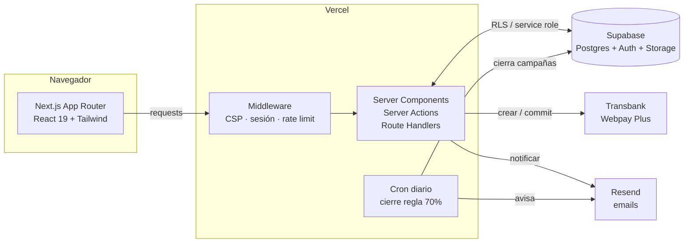
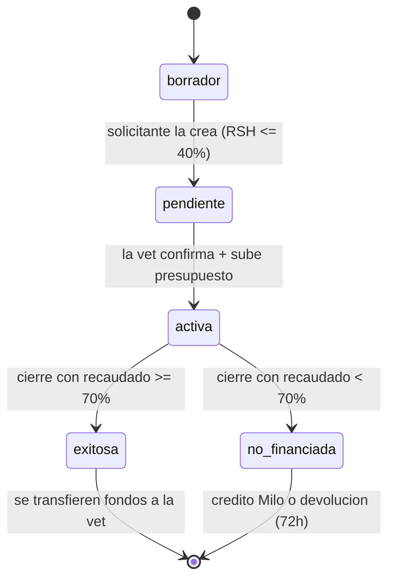
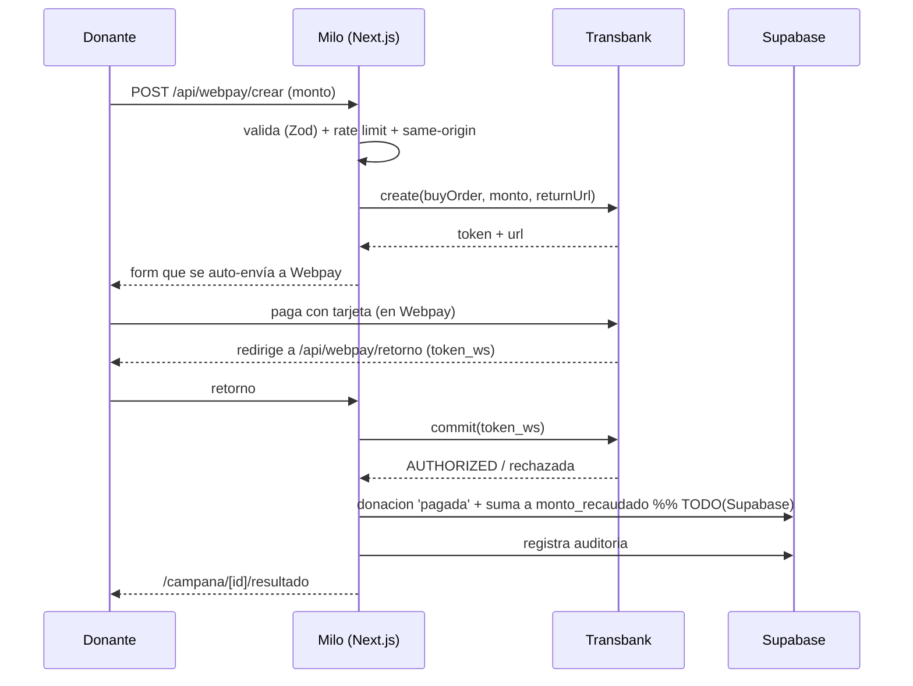

# Arquitectura — Milo

Visión general de cómo se conectan las piezas y los dos flujos críticos
(campaña y donación). Los diagramas son Mermaid (GitHub los renderiza solo).

---

## Sistema y servicios



> El solicitante valida su RSH subiendo la **Cartola Hogar (PDF)**, que se procesa
> server-side (`lib/cartola.ts`). Milo no integra Clave Única.

**Claves de seguridad:** el navegador nunca habla directo con Supabase para datos
sensibles (todo pasa por RLS o por el servidor con *service role*); las tarjetas
nunca tocan el servidor de Milo (100% en Webpay); los documentos privados viven
en el bucket `documentos` con URLs firmadas.

---

## Ciclo de vida de una campaña



- **borrador → pendiente:** la crea el solicitante, validando su **Cartola RSH
  (PDF)**: RUT coincide, < 90 días, tramo ≤ 40%. No se activa sola.
- **pendiente → activa:** la veterinaria **verificada** confirma el caso y sube el
  presupuesto PDF. Recién ahí es pública y recibe donaciones. *(Las campañas
  > $200.000 requieren además revisión manual del equipo Milo.)*
- **activa → exitosa / no_financiada:** el cron diario aplica la **regla del 70%**
  al llegar la `fecha_limite`.
- El `monto_meta` queda **congelado** una vez confirmada (trigger en BD).

---

## Flujo de una donación



Al **cierre exitoso** de la campaña, los fondos recaudados se transfieren a la
veterinaria (paso de back-office, marcado como `TODO` en `lib/cerrar-campanas.ts`).
Si la campaña **no se financia**, cada donante elige: redirigir su aporte a otra
campaña, dejarlo como **crédito Milo**, o pedir **devolución en efectivo dentro de
72 horas**.

---

## Mapa de carpetas (resumen)

```
src/
  app/
    page.tsx                  feed público
    campana/[id]/             detalle + donación + devolución
    campanas/nueva/           crear campaña (solicitante)
    veterinaria/              panel: confirmar casos
    mis-campanas/             campañas del solicitante
    login, registro/          auth 3 roles (+ registro/solicitante)
    exitos/                   feed de éxitos
    api/webpay/               crear + retorno (Transbank)
    api/cron/cerrar-campanas/ cierre regla 70% (protegido)
    auth/{callback,signout}/  OAuth Google + logout
  components/                 UI (CampanaCard, auth/, veterinaria/, campanas/…)
  lib/
    supabase/{client,server,admin,middleware,config}.ts
    transbank/  resend/  validaciones.ts  rate-limit.ts  seguridad.ts
    cartola.ts  rut.ts  auditoria.ts  cierre.ts  uploads.ts  storage.ts
  middleware.ts               CSP + sesión + rate limit
supabase/migrations/          001..007 (aplicar en orden)
```
